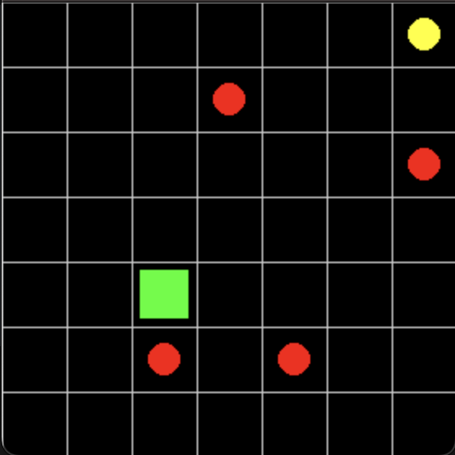
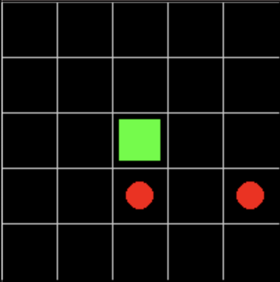

# The Implemention Of Artificial Neural Network In Deep Q Learning

This project is an example of DQN algorithm. I trained an agent that playing 2D dodge game

## Environment
In 'game.py', I defined the game and the rewards. This is a dodge game where balls move diagonally, vertically, or horizontally. The goal of the game is to reach the yellow point without colliding with any balls.
The character has 5 moves. 
* up
* down
* left
* right
* nothing

The goal point always stays in the same place until the character reaches it. The game is set in a  \(n\) x \(n\) grid world where each part is represented by an integer.
* -1 : The goal square
* 0 : Empty square
* 1 : The character
* 3 : Ball (Going **diagonally** up and right)
* 4 : Ball (Going **diagonally** up and left)
* 5 : Ball (Going **diagonally** down and right)
* 6 : Ball (Going **diagonally** down and left)
* 7 : Ball (Going **vertically** up)
* 8 : Ball (Going **vertically** down)
* 9 : Ball (Going **horizontally** left)
* 10 : Ball (Going **horizontally** right)

|  0  |  0  |  0  |  0  |  0  |  -1  |
|:---:|:---:|:---:|:---:|:---:|:---:|
|  0  |  0  |  9  |  0  |  0  |  0  |
|  0  |  0  |  0  |  0  |  0  |  5  |
|  0  |  0  |  0  |  0  |  0  |  0  |
|  0  |  1  |  0  |  0  |  0  |  0  |
|  0  |  3  |  0  |  7  |  0  |  0  |
|  0  |  0  |  0  |  0  |  0  |  0  |

## Reward System
The rewards depend on the action taken:

* If the character collides with a ball, the reward is **-7**.
* If the character reaches the goal, the reward is **5**.
* If the character gets closer to the goal, the reward is **0.7**.
* If the character moves away from the goal, the reward is **-1**.
* If the character collides with a wall, the reward is **-3**.
* If the character does nothing, the reward is **-0.1**.

The agent will tend to reach the goal as quickly as possible because its objective is to maximize the reward.

## Agent
Our agent maximizes its reward by interacting with the environment. The agent receives the game state and chooses an action. The action can be either random or predicted by a neural network. Based on the result of the action, the agent receives a reward. And based on that reward, agent updates his model and choose better action in the next states.
The agent has two models:

* **Main Model**
  - This model predicts the Q-values for every action given the current state.
  - The agent chooses the action with the highest Q-value.

* **Target Model**
  - This model predicts the Q-values for every action given the next state.
  - The agent uses this model as the label for supervised learning.

The weights of the target model are updated to match the weights of the main model every \( C \) steps.

The agent cannot see the entire \(n \times n\) grid. The agent can only see a \(5 \times 5\) matrix centered on the character, along with a vector indicating the position of the goal relative to the agent's location.

|  0  |  0  |  0  |  0  |  0  |
|:---:|:---:|:---:|:---:|:---:|
|  0  |  0  |  0  |  0  |  0  |     
|  0  |  0  |  1  |  0  |  0  |
|  0  |  0  |  3  |  0  |  7  |
|  0  |  0  |  0  |  0  |  0  |

## Replay Buffer

In Deep Q-Learning (DQN), the replay buffer (or experience replay) is a crucial component that helps stabilize and improve the training of the Q-network. It works by storing the agent's experiences over time and using these experiences to train the network.

### Concept

The replay buffer is a data structure that stores the agent’s past experiences. Each experience is a tuple consisting of:

- **State**: The state of the environment before taking the action.
- **Action**: The action taken by the agent.
- **Reward**: The reward received after taking the action.
- **Next State**: The state of the environment after the action was taken.
- **Is Terminal**: A boolean value indicating whether the next state is a terminal state.

The (State, Action, Reward, Next State, Is Terminal) tuple is an experience. The replay buffer stores these experiences and provides some sample experiences when the agent is training.

## Deep Q-Learning Algorithm

- Initialize the environment.
- Initialize the agent (main network and target network).

For each episode:
  - While the state is not terminal:
    - Get the environment state to choose an action.
    - Choose an action (either randomly or using the policy).
    - Execute the action in the environment and observe the reward, next state, and whether the state is terminal.
    - Store the experience (state, action, reward, next state, is terminal) in the replay buffer.
    - If there is enough experience in the replay buffer:
      - Get a batch of experiences.
      - Prepare the labels for supervised learning.
      - Train the model using the batch of experiences.
      - If \( C \) steps have been completed, update the target network weights to match the main network weights.

### How to Prepare Labels

After getting a batch of experiences:

For each experience in the batch:
  - If `experience.is_terminal`:
    - \( y_{\text{true}} = \text{experience.reward} \)
  - Else:
    - \( y_{\text{true}} = \text{experience.reward} + \gamma \cdot \max(\text{target network}(\text{experience.nextstate})) \)

(\(\gamma\) is the discount factor between 0 and 1. If \(\gamma\) is close to 0, the model tends to focus on the current state. If \(\gamma\) is close to 1, the model considers future states more significantly.)

## Implementation

In the `deepql.py` file, I implemented the DQN algorithm for 500 games. The `helper.py` file includes some helper functions, such as visualizing the game and the agent's performance. In the `test.py` file, you can test the trained agent. All the games during training and testing will be saved in the `Games` folder.
`main_model.keras` is the trained model with 500 game 

