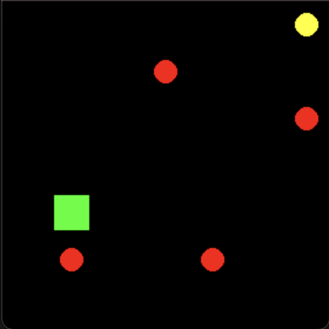

# The Implemention Of Artificial Neural Network In Deep Q Learning

This project is an example of DQN algorithm. I trained an agent that playing 2D dodge game

<video src="[LINK](https://github.com/user-attachments/assets/3c4d2818-8a77-4a91-80d8-50e3e04f1c14)" controls="controls" style="max-width: 730px;">
</video>

## Environment
In 'game.py', I defined the game and the rewards. This is a dodge game where balls move diagonally, vertically, or horizontally. The goal of the game is to reach the yellow point without colliding with any balls.
The character has 5 moves. 
* up
* down
* left
* right
* nothing

The yellow point always stays in the same place until the character reaches it. The game is set in a grid world where each part is represented by an integer.
* -1 : The goal square
* 0 : Empty square
* 1 : The character
* 3 : Ball (Going **diagonally** up and right)
* 4 : Ball (Going **diagonally** up and left)
* 5 : Ball (Going **diagonally** down and right)
* 6 : Ball (Going **diagonally** down and left)
* 7 : Ball (Going **vertically** up)
* 8 : Ball (Going **vertically** down)
* 9 : Ball (Going **horizontally** left)
* 10 : Ball (Going **horizontally** right)

|  0  |  0  |  0  |  0  |  0  |  -1  |
|:---:|:---:|:---:|:---:|:---:|:---:|
|  0  |  0  |  9  |  0  |  0  |  0  |
|  0  |  0  |  0  |  0  |  0  |  5  |
|  0  |  0  |  0  |  0  |  0  |  0  |
|  0  |  1  |  0  |  0  |  0  |  0  |
|  0  |  3  |  0  |  7  |  0  |  0  |
|  0  |  0  |  0  |  0  |  0  |  0  |

